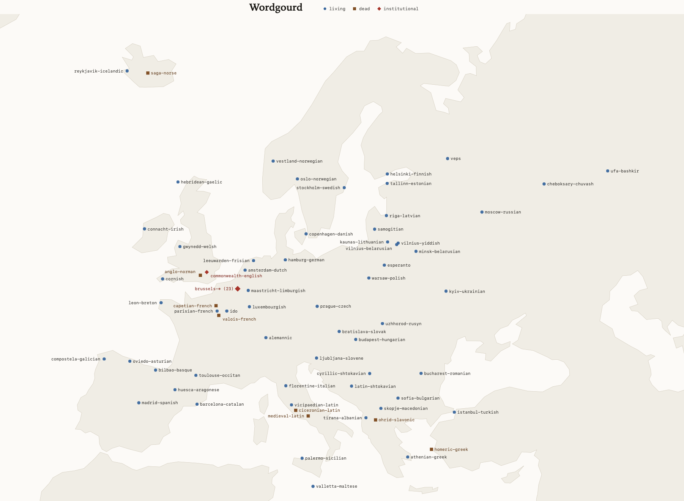

# Wordgourd

In Hawaiian, a database is hōkeo ʻikepili, a storage gourd of data. This is delightful.
Many dialects are not covered today by dialect identification because they lack a good wiki.
Worse still, many of the foundational texts of our society are not covered either.
We close our eyes to the Eddas, to Cicero and to the Bible.

I ventured to fix this; what resulted was a corpus of texts across 146 written varieties:
living dialects, dead tongues, and institutional registers. 150 texts per node, 21,900 in all,
licensed CC-BY-SA-4.0 as a package, with many nodes freer than that
([SOURCES.md](SOURCES.md) says which). These are mostly non-synthetic, sourced
primarily from Wikipedia ([FineWiki](https://huggingface.co/datasets/HuggingFaceFW/finewiki))
and a number of other sources: scholarly corpora like Perseus and the Base de
Francais Medieval, scanned books and newspapers from the Internet Archive
and the Library of Congress, Wikisource, and the EU's legal corpus through EUR-Lex.
The full list, with every licence and the receipt it was read from, is in [SOURCES.md](SOURCES.md).

The world map and the other regional panels are in [maps/](maps/).

One unusual choice is separating some pairs of nodes by cutting their Venn
overlap. Wikipedia prose is not casual speech: it leans institutional. So
the institutional register got nodes of its own, sourced from the EU's
legal corpus, the US Federal Register and UK legislation (the brussels-*
nodes, washington-english and commonwealth-english). This and other changes are 
documented in [CHANGES.md](CHANGES.md).

I have also carefully cut, boiled and stir-fried the data for a while now. 
Data is never perfect, and I've listed all the problems I could find 
in [PROBLEMS.md](PROBLEMS.md); doubtlessly there are more. 

I hope this helps the community be more in touch with the humanities. 
It is also an invitation to help keep the past and smaller communities alive. 
Identification tools sit at the lip of the pipeline and what categories and 
definitions we have can make the difference between covered and erased.